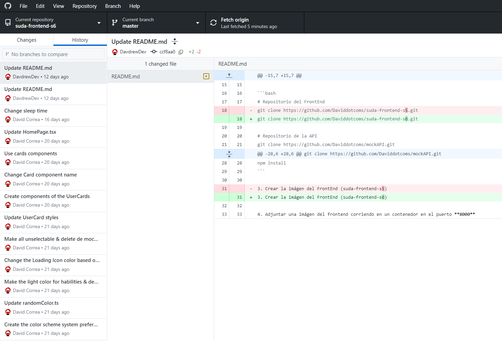
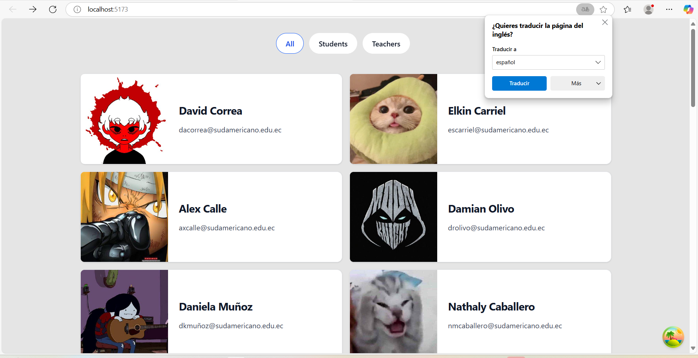
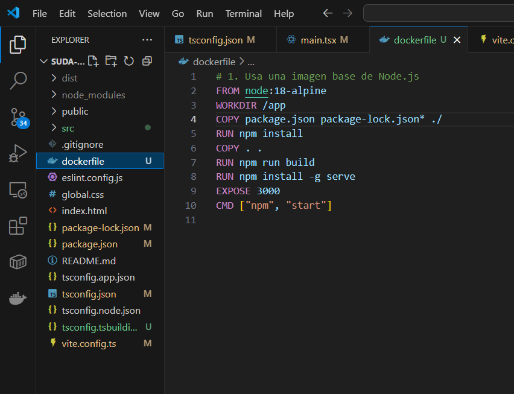
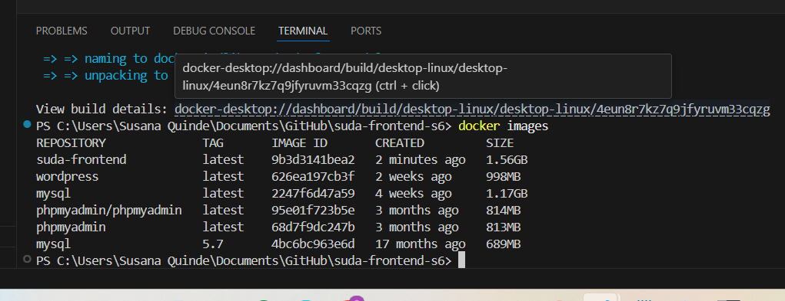
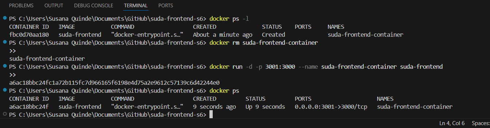
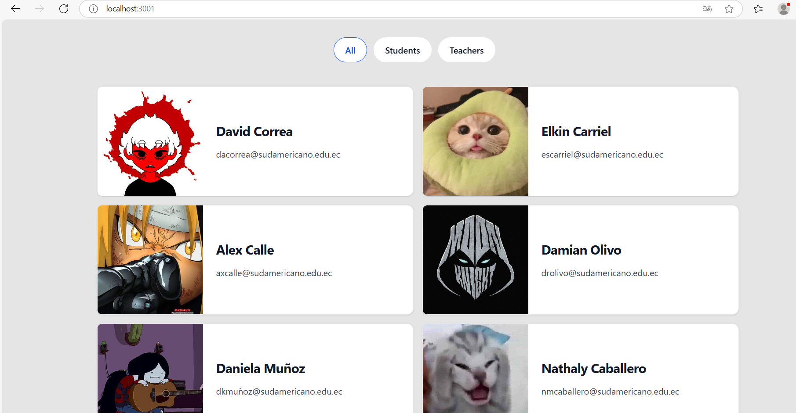

# Practica servidor web
## 1. Titulo
Configuración de dockerFile
## 2. Tiempo de duración
39 horas 
## 3. Fundamentos:
- Imagen Docker: es una plantilla inmutable que contiene todo el entorno necesario para ejecutar una aplicación: código fuente, bibliotecas y configuración del sistema. (Merkel, 2014)

- Un contenedor es una instancia en ejecución de una imagen Docker, que se ejecuta de manera aislada del sistema operativo anfitrión. (Turnbull, 2014)

- Dockerfile es un archivo de texto con una serie de comandos. (Pahl, 2015)

- Comando build: generar una nueva imagen a partir de un archivo Dockerfile.

- Vite: es una herramienta de construcción y desarrollo para aplicaciones web frontend, especialmente diseñada para proyectos con React, Vue, Svelte, y otros frameworks modernos. (Cube, 2016)
## 4. Conocimientos previos.
   
Para realizar esta practica el estudiante necesita tener claro los siguientes temas:
- Contenedores.
- Puerto de salida.
- Ip.
- Documento docker-compose.yml
- Docker file
- Frontend
- Backend
## 5. Objetivos a alcanzar

- Identificar las instrucciones básicas de un Dockerfile 
- Construir imágenes personalizadas utilizando el comando docker build y entender el contexto de construcción.
- Comprender el flujo de construcción de una imagen desde el Dockerfile hasta el contenedor en ejecución.
## 6. Equipo necesario:
  
- Computador con sistema operativo Windows/Linux
- Plataforma Docker playground o desktop.

## 7. Material de apoyo.
   
- Documentacion de tendencias tecnologicas.
- Docker desktop
- Videos ilustrativos
- Documentacion sobre la configuracion del documento dockerFile.
  
## 8. Procedimiento

Paso 1:Clona el repositorio del proyecto frontend.
 

Paso 2:Ejecuta el proyecto localmente para verificar su correcto funcionamiento.
 

Paso 3: Crea un archivo Dockerfile adecuado para contenerizar la aplicación.

paso 4: Genera la imagen Docker a partir del Dockerfile creado.

paso 5: Crear el contenedor con la aplicación
 

paso 6: Verificaicon en el puerto 3001
 

## 9. Resultados esperados:
    
Despues de esta práctica podemos concluir que toda es importante la creacion de una imagen personalizada para nuestra aplicacion, debido a que como desarrolladores vamos a tener nuestras propias paginas con codigos especificos por lo que en esos casos no podriamos usar imagenes predeterminadas del docker hub.

## 10. Bibliografía
    

Combe, T., Martin, A., & Di Pietro, R. (2016). To Docker or not to Docker: A security perspective. IEEE Cloud Computing, 3(5), 54–62. https://doi.org/10.1109/MCC.2016.100

Merkel, D. (2014). Docker: lightweight Linux containers for consistent development and deployment. Linux Journal, 2014(239), 2. https://dl.acm.org/doi/10.5555/2600239.2600241

Pahl, C. (2015). Containerization and the PaaS cloud. IEEE Cloud Computing, 2(3), 24–31. https://doi.org/10.1109/MCC.2015.51

Turnbull, J. (2014). The Docker Book: Containerization is the new virtualization. James Turnbull.

audio:

<audio controls>
  <source src="media/nota.ogg" type="audio/ogg">
 
</audio>
